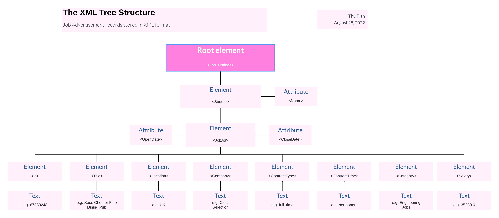

<h3 style="color:#ffc0cb;font-size:30px;font-family:Georgia;text-align:center;"><strong>Data Parsing, Cleansing & Integration Job Ad</strong></h3>

# Background
Nowadays there are many job hunting websites including seek.com, Azuna.com, etc. These job hunting sites
all manage a job search system, where job hunters could search for relevant jobs based on keywords, salary,
and categories, etc. Job advertisement data analysis is becoming increasingly important and beneficial for job
hunting sites, as they can be used to make improvements on the experience of users searching for jobs.
This assessment assumes that you, as a data analyst, are required to wrangle a large set of job advertisement
records stored in xml format and with unknown data quality issues, you will also be required to integrate the
given data set with another data source, identify and resolve conflicts in data integration. 3 major tasks that are specified as follows, which has to be completed in order:

# Challenges of data analytics
This scenario describes 3 challenges in volume, variety, and value.

+ Volume This scenario describes huge JSON files to be combined with transactional data in CSV format

+ Variety This scenario has three data source types: transactional data and recommendation information that is likely in a key-value format.

+ Value This scenario will populate dashboards that are used by decision makers as soon as they are made available. The value is reached because it requires an understanding of what the organization is trying to accomplish. A thorough understanding of these initiatives is key.

# Steps

+ In Task 1, I will explore the first dataset, identify its format. I will then use appropriate Python
tools and libraries to parse the data into a pandas dataframe;

+ Once I successfully parse the data, in Task 2, I will need to explore the data further, identify and
fix data problems in the dataset, and finally output the clean data as per required format.

+ Then in Task 3, I will integrate the cleaned dataset (the output from Task 2) and a 2nd dataset. I
will need to resolve any schema level conflicts, merge the data, and then identify and fix any
data-level conflicts that may exist.

| **COLUMN**   | **DESCRIPTION**                                               |
|--------------|---------------------------------------------------------------|
| Id           | 8 digit Id of the job advertisement                           |
| Title        | Title of the advertised job position                          |
| Location     | Location of the advertised job position                       |
| Company      | Company (employer) of the advertised job position             |
| ContractType | The contract type of the advertised job position              |
| ContractTime | The contract time of the advertised job position              |
| Category     | The category of the advertised job position                   |
| Salary       | Annual salary of the advertised job position                  |
| OpenDate     | The opening time for the job application                      |
| CloseDate    | The closing time for applying for the advertised job position |
| SourceName   | The website where the job position is advertised              |

